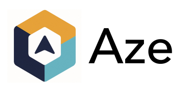

# Aze Starter



🚀 Starter template with **Nx, Next.js, NestJS, Prisma, Docker, Kubernetes, Helm & ArgoCD** — production-ready monorepo for modern full-stack apps.

# 🚀 Full-Stack Starter Template

A production-ready **starter template** built with cutting-edge tools and frameworks to accelerate modern full-stack application development. Designed for scalability, developer productivity, and cloud-native deployments.

---

## ✨ Features

- **Monorepo with Nx** – Efficiently manage multiple apps and shared libraries in a single workspace.  
- **Frontend: Next.js** – React-based framework with SSR, SSG, API routes, and full TypeScript support.  
- **Backend: NestJS** – Scalable server-side framework for building reliable APIs and microservices.  
- **Database: Prisma ORM** – Type-safe database client with schema-driven migrations.  

## ✨ Upcoming Features 
- **Containerization: Docker** – Seamless local development and environment parity.  
- **Orchestration: Kubernetes** – Scalable deployments across clusters.  
- **Helm Charts** – Declarative configuration management for Kubernetes apps.  
- **GitOps with ArgoCD** – Continuous Delivery with version-controlled Kubernetes deployments.  

---

## 📂 Project Structure

```

.
├── apps/
│   ├── aze-client/      # Next.js app as the Frontend app
│   └── aze-api/         # NestJS app as the Backend service
├── libs/                # Shared libraries
├── charts/              # Helm charts for K8s deployments
├── docker/              # Dockerfiles and Compose setup
└── infra/               # Kubernetes manifests & ArgoCD configs

````

---

## ⚡ Getting Started

### Prerequisites
- Node.js (>=18)
- Nx CLI
- NestJc CLI

### Clone & Install

```bash
git clone https://github.com/aruzone/aze-mini.git
cd aze-mini
npm install
```

### Run Aze API Backend

```
# CREATE BACKEND ENV FILE
cp apps/aze-api/.env.example apps/aze-api/.env

# RUN BACKEND
nx serve aze-api
```
Backend → [http://localhost:3030/api](http://localhost:3030/api)

### Run Aze App Frontend

```
nx dev aze-client
```
Frontend → [http://localhost:3000](http://localhost:3000)

### Important Documentation Links
- [NestJS](https://docs.nestjs.com/)
- [NextJS](https://nextjs.org/docs)
- [Prisma](https://www.prisma.io/docs/orm)
---

## 🚀 Roadmap

* [ ] Add authentication (JWT / OAuth2)
* [ ] Integrate caching (Redis)
* [ ] Add CI/CD pipeline (GitHub Actions / GitLab CI)
* [ ] Expand Helm charts with configurable values

---

## 📜 License

MIT License – feel free to use this template for your own projects.