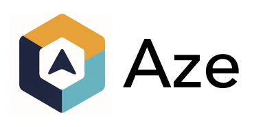

# Aze Starter



[](https://github.com/aruzone/aze-mini/actions/workflows/ci.yml)

A full-stack starter template: **Nx**, **Next.js**, **NestJS**, **Prisma**,
Postgres, Redis, Docker, Helm and Argo CD. Clone it, delete the Demo, and build
your own thing on what is left.

## What this is, and what it is not

It is a working Starter with the awkward parts already joined up — a login that
issues a real token, a client that holds it safely, a cache with real
invalidation, migrations that run on deploy, images that build.

It is **not production-ready**, and nothing here claims to be. It is a starting
point that has been thought about, with its gaps written down rather than left
for you to find. Before you deploy it anywhere real, read
**[docs/deployment.md](docs/deployment.md)** — that is the list of what is still
yours to do.

### The Starter is a snapshot

When you clone this, you own the result outright. **There is no update path.**
Fixes made here later — including security fixes — will not reach your project,
and there is no supported way to pull them in.

Releases are tagged so you can tell what you started from, and that is all the
relationship there is ([ADR-0004](docs/adr/0004-clone-and-own-no-update-path.md)).
The security posture at the moment you clone is the posture you keep, which is
why the credential path here is held to a production bar rather than a
demonstration one — and why the parts that are *not* held to that bar say so out
loud.

### Platform and Demo

Two tiers, and the difference matters:

- **Platform** — what you keep and build on: auth, the request perimeter, the
  cache, the error envelope, the session, the CI.
- **Demo** — a product catalogue, a seeded User, one machine-to-machine route,
  the Helm chart. There to show a pattern once. Read it, then delete it.

**[docs/demo.md](docs/demo.md)** is the removal guide: the exact paths to delete,
the order to work in, and how to check that what is left still works.

## Layout

```
.
├── apps/
│   ├── aze-api/              NestJS API        → :3030/api
│   ├── aze-api-e2e/          API e2e (Jest)
│   ├── aze-client/           Next.js client    → :3000
│   └── aze-client-e2e/       Client e2e (Playwright)
├── libs/
│   ├── platform-contracts/   Wire shapes you keep    (tier:platform)
│   └── demo-contracts/       Wire shapes you delete  (tier:demo)
├── deploy/
│   ├── helm/aze/             Barebones chart for both apps
│   └── argocd/               One Application pointing at it
├── docs/
│   ├── adr/                  Decisions, and why
│   ├── demo.md               How to strip the Demo
│   └── deployment.md         Before you deploy
└── docker-compose.yml        Postgres, Redis, and both apps
```

## Getting started

Two ways in. Everything in Docker is fewer steps; the local toolchain is what
you want for day-to-day work.

### Everything in Docker

Docker is the only prerequisite.

```bash
git clone https://github.com/aruzone/aze-mini.git
cd aze-mini

# Builds both images, starts Postgres and Redis, applies the migrations, and
# brings both apps up. --wait blocks until they are actually answering.
docker compose up -d --build --wait

# Optional: the Demo catalogue and a User to sign in as. Prints the login.
docker compose run --rm migrate npx prisma db seed
```

- Client → <http://localhost:3000>
- API → <http://localhost:3030/api>
- API docs → <http://localhost:3030/api/docs>

The compose file carries real, committed, public credentials for local use.
They are not secrets and are not fit to be. Replace them before running that
file anywhere but your own machine.

### The local toolchain

Node 24 (`.nvmrc` — `nvm use` picks it up) and Docker for Postgres and Redis.

```bash
npm install

# Postgres and Redis only. There is no file-based fallback (ADR-0001); the
# cache fails open, so the API still works without Redis (ADR-0005).
docker compose up -d --wait postgres redis

cd apps/aze-api
cp .env.example .env
# Replace API_KEY and JWT_SECRET. Both ship as placeholders and the API
# refuses to start while either is unedited.

npx prisma migrate dev   # applies migrations and regenerates the client
npx prisma db seed       # Demo catalogue and User; prints the login

cd ../..
nx serve aze-api         # → http://localhost:3030/api
nx dev aze-client        # → http://localhost:3000
```

Running a second clone at the same time? Give it its own project name and host
ports, then put those ports in that clone's `apps/aze-api/.env`:

```bash
POSTGRES_PORT=5433 REDIS_PORT=6380 docker compose -p aze-two up -d --wait
```

## Working on it

```bash
nx run-many -t lint test build --all   # everything
nx test aze-api                        # one project
nx e2e aze-api-e2e                     # API e2e — needs Postgres and Redis
nx e2e aze-client-e2e                  # client e2e — needs both apps running
```

The client e2e drives your installed Google Chrome, so nothing has to be
downloaded first.

CI runs on every pull request: `nx affected -t lint test build`, and the API e2e
suite against real Postgres and Redis services. It reads no repository secrets,
so it runs unchanged in a fork.

## What is worth reading

| Where | What is in it |
| --- | --- |
| [docs/demo.md](docs/demo.md) | The Demo, and how to delete it |
| [docs/deployment.md](docs/deployment.md) | Before you deploy: the honest checklist |
| [docs/adr/](docs/adr/) | The decisions, and why they went that way |
| [docs/architecture-overview.md](docs/architecture-overview.md) | How the pieces fit |
| [docs/data-contracts.md](docs/data-contracts.md) | The database's shapes, and the wire's |
| [deploy/README.md](deploy/README.md) | The chart, and what it leaves to you |
| [CLAUDE.md](CLAUDE.md) | Orientation for coding agents |

## License

MIT. Use it for whatever you like.
